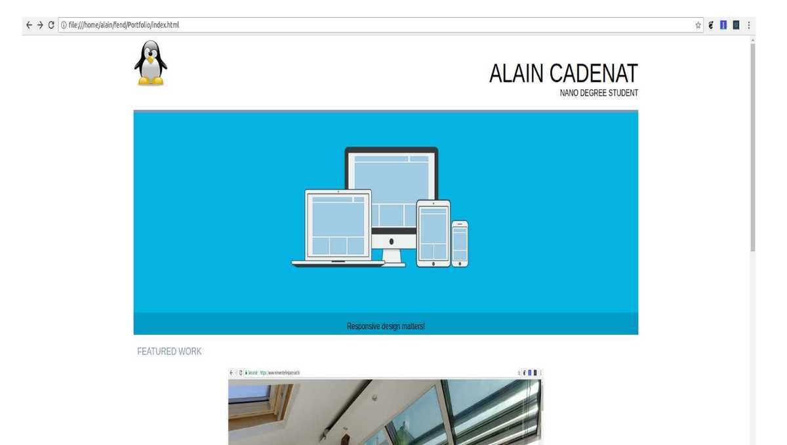

# Portfolio
### Description
This project design a responsive website for Portfolio according to this design:

<!-- TODO: Put actual image -->

 
The portfolio diplays the name and job of the author, an illustration image and 3 recent works realized by the author.
Responsivness is mostly designed for Desktop, Apple Ipad and Nexus 5 but it should be ok on most devices.
It have been tested with Chrome Dev. Tools and on a Galaxy S4.

The portfolio has 5 different views according to the size of the device's screen.
* Small screens (>230 pixel width)
* Mobile (same view for horizontal or vertical)
* Tablet (vertical)
* Tablet (horizontal)
* Desktop

### Installation
Clone repository or download files. Then open index.html in your browser.

### Author
Alain CADENAT

### Credits
Mockup: www.udacity.com

Logo and responsive illustration: www.pixabay.com

### Known issues
With very small screens (width<230px),the header have some issues, the text covers the logo. The only fix would be to hide the logo. I didn't do it as per the project review document.
### Possible issues
Never tested on very large screen like HD or 4k TV set.
