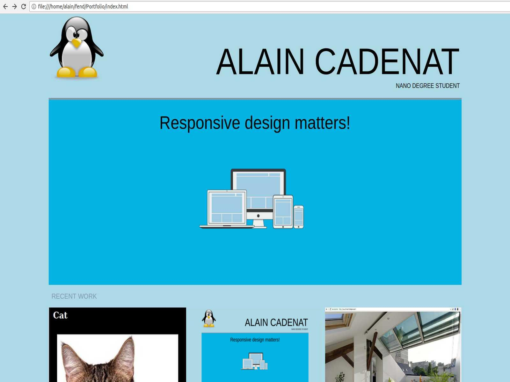

# Portfolio
### Description
This project design a responsive website for Portfolio according to this design:

<!-- TODO: Put actual image -->

 
The portfolio diplays the name and job of the author, an illustration image and 3 recent works realized by the author.
Responsivness is mostly designed for Desktop, Apple Ipad and Nexus 5 but it should be ok on most devices.
It have been tested with Chrome Dev. Tools and on a real Galaxy S4.

The portfolio has 4 different views according to the size of the device's screen.

* Mobile (same view for horizontal or vertical)
* Tablet (vertical)
* Tablet (horizontal)
* Desktop

Follow this link to see the page:
https://alain91530.github.io/portfolio/index.html

### Installation
Clone repository or download files. Then open index.html in your browser.

### Author
Alain CADENAT

### Credits
_Mockup_: https://www.udacity.com

_Logo and responsive illustration_: https://www.pixabay.com

### Possible issues
Never tested on very large screen like HD or 4k TV set.
### License
MIT License

Copyright (c) 2018 Alain CADENAT

Permission is hereby granted, free of charge, to any person obtaining a copy
of this software and associated documentation files (the "Software"), to deal
in the Software without restriction, including without limitation the rights
to use, copy, modify, merge, publish, distribute, sublicense, and/or sell
copies of the Software, and to permit persons to whom the Software is
furnished to do so, subject to the following conditions:

The above copyright notice and this permission notice shall be included in all
copies or substantial portions of the Software.

THE SOFTWARE IS PROVIDED "AS IS", WITHOUT WARRANTY OF ANY KIND, EXPRESS OR
IMPLIED, INCLUDING BUT NOT LIMITED TO THE WARRANTIES OF MERCHANTABILITY,
FITNESS FOR A PARTICULAR PURPOSE AND NONINFRINGEMENT. IN NO EVENT SHALL THE
AUTHORS OR COPYRIGHT HOLDERS BE LIABLE FOR ANY CLAIM, DAMAGES OR OTHER
LIABILITY, WHETHER IN AN ACTION OF CONTRACT, TORT OR OTHERWISE, ARISING FROM,
OUT OF OR IN CONNECTION WITH THE SOFTWARE OR THE USE OR OTHER DEALINGS IN THE
SOFTWARE.
